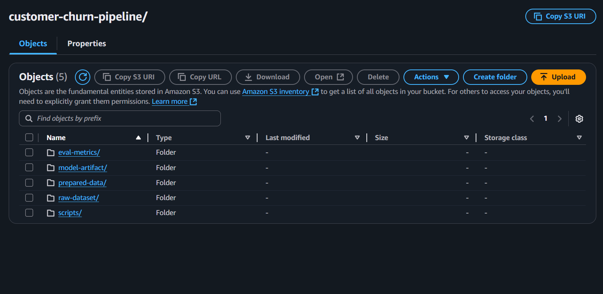
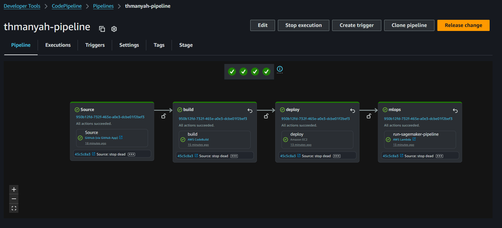
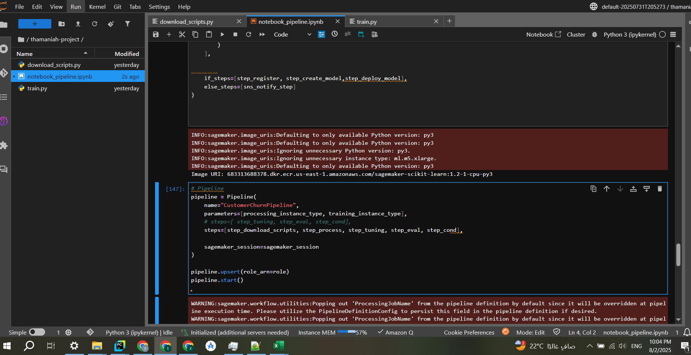
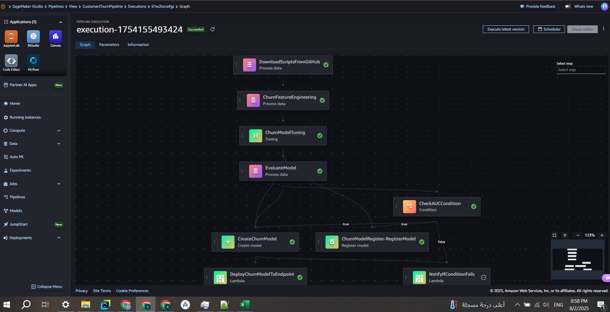
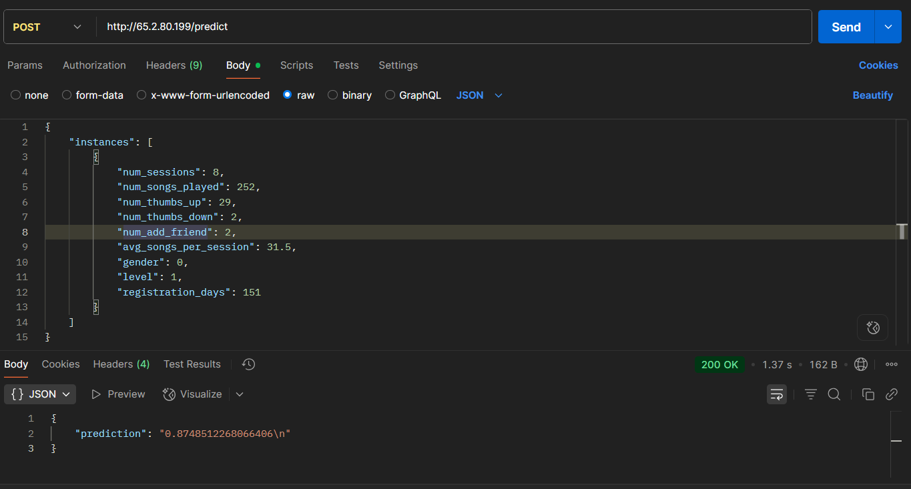

# Customer Churn Prediction Project 🚀

This project was implemented as part of the take-home assignment for the Senior Machine Learning Engineer role. While the original scope focused on building a churn prediction model, I extended it to include **complete MLOps and DevOps automation using AWS services**. The objective was to build a production-grade, scalable, and automated machine learning system.

> **Note**: Model tuning was not the main focus since the emphasis was on infrastructure design, automation, and reliability.

---

## 🔧 Tools & Technologies Used

| Tool | Purpose |
|------|---------|
| **FastAPI** | Inference API |
| **GitHub** | Source control & Actions |
| **Docker** | Containerization |
| **Amazon S3** | Data storage & access by pipeline |
| **Amazon EC2** | Model inference host |
| **Amazon ECR** | Container registry |
| **AWS Lambda** | Trigger SageMaker pipelines, endpoint deployment logic |
| **AWS CodeBuild** | Build container from GitHub push |
| **AWS CodePipeline** | CI/CD Orchestration |
| **Amazon SageMaker** | Model training, tuning, deployment |
| **SageMaker Studio** | Visual MLOps orchestration |
| **MLflow** | Experiment tracking |
| **Multi-region AWS Setup** | To separate MLOps and DevOps logic |

### 🌎 Architecture Overview

*Full CI/CD + MLOps Pipeline visual showing FastAPI → GitHub → CodePipeline → Lambda → SageMaker.*

*CodePipeline automates FastAPI containerization and triggers the MLOps pipeline.*

---

## 💡 Modeling Approach

The churn problem is highly imbalanced. To ensure minimal business risk, I prioritized **minimizing false negatives** (users predicted to stay but actually churn). Hence, the **XGBoost** model was trained with a focus on **Recall**.

```python
from sklearn.metrics import recall_score
recall_score(y_true, y_pred)
```

---

## 🏋️‍♂️ Phase 1: Exploratory Analysis on Kaggle

Initial data cleaning, feature exploration, and baseline model training were performed in a public Kaggle notebook.

You can view the full exploratory analysis and initial modeling here:  
🔗 [Kaggle Notebook – thamaniah-task](https://www.kaggle.com/code/zaidali11/thamaniah-task)

---

## 🏢 Phase 2: FastAPI Application & DevOps Infrastructure

The FastAPI application includes:

- `train.py`: Training and hyperparameter tuning
- `evaluate.py`: Evaluation & model selection
- `download_scripts.py`: Downloads required assets
- `inference.py`: FastAPI serving endpoint
- `Dockerfile`, `lambda_functions/`, `Makefile`, `pre-commit`, `scripts/`

All assets are stored in **S3**:



The following AWS infrastructure was used:

- **EC2** instance hosting inference API
- **ECR** to store versioned Docker images
- **CodePipeline** to automate container build, push, deploy
- **Lambda** to trigger SageMaker MLOps pipeline post-deploy



The CI/CD process is triggered via GitHub actions. Once a new commit is pushed:
- CodeBuild builds a new container image
- Pushes to ECR
- Deploys to EC2
- Then triggers a Lambda function to launch SageMaker Pipeline

---

## 🚀 Phase 3: SageMaker Pipeline (MLOps)

Implemented using **SageMaker Studio**:



🧾 Also implemented as a notebook and included in the repository: `notebook_pipeline.ipynb`

### ✅ Pipeline Steps:
1. Download scripts from GitHub into S3
2. Preprocess and split data
3. Train model and perform hyperparameter tuning (recall-focused)
4. Evaluate model against the current best
5. Conditionally deploy if new model is better; otherwise, send alert via SNS



### 🔁 Trigger Logic:
- Pushing new code to GitHub
- Uploading new raw data to S3 (`raw-dataset/`)

---

## 📊 Inference Test

Live inference API endpoint:

**URL**: `http://65.2.80.199/predict`

**Sample Payload:**
```json
{
  "instances": [
    {
      "num_sessions": 8,
      "num_songs_played": 252,
      "num_thumbs_up": 29,
      "num_thumbs_down": 2,
      "num_add_friend": 2,
      "avg_songs_per_session": 31.5,
      "gender": 0,
      "level": 1,
      "registration_days": 151
    }
  ]
}
```

**Sample Response:**
```json
{
  "prediction": "0.8748512268066406\n"
}
```



---

## 🧠 Challenges & Highlights

- Multi-region deployment: DevOps and MLOps split
- Full CI/CD with GitHub → Docker → ECR → EC2
- Automating model comparison and endpoint swapping
- Reducing false negatives by optimizing recall

---

## 🧳 Future Improvements

- Integrate CloudWatch + SageMaker baseline capture for drift
- Auto-scale EC2 with ECS or Fargate
- Use AWS Step Functions for orchestration
- Adopt SageMaker Model Registry & multi-model hosting

---

## 📖 Conclusion

This project reflects **production-grade ML engineering practices** with automation, scalability, and maintainability across DevOps and MLOps.


Crafted with care by **Zaid Alshami** ✨
